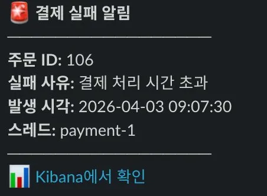
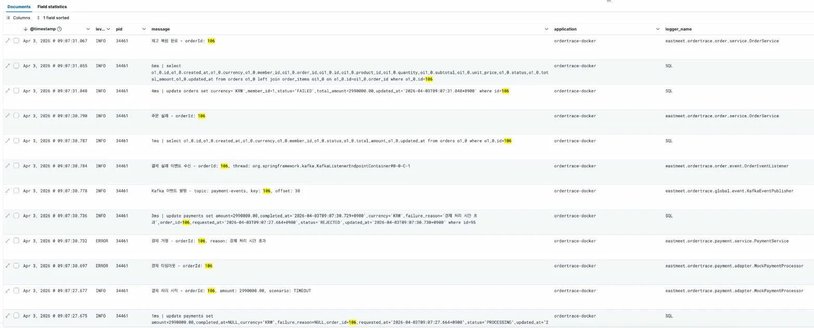

# OrderTrace

> 주문 서비스의 활력 징후를 실시간으로 추적하는 모니터링 시스템

DDD 기반 모듈러 모놀리스 주문-결제 서비스에 Kafka 이벤트 통신, EFK 로그 파이프라인, Slack 에러 알림을 구축한 포트폴리오 프로젝트입니다.

---

## 프로젝트 배경

### 실무에서 겪은 문제

이전 회사(B2B SaaS)에서 프론트엔드-백엔드 협업 시 다음과 같은 문제를 겪었습니다.

**1. 에러 원인 파악에 과도한 시간 소요**

프론트엔드에서 API 호출 시 에러가 발생하면, 어떤 요청 파라미터가 잘못되었는지 확인하기 위해 백엔드 개발자가 직접 서버에 SSH 접속하여 로그 파일을 열어봐야 했습니다. 리눅스 환경에서 `vi`로 수백 MB 로그 파일을 열고, `/keyword`로 검색하면서 해당 시점의 에러 로그를 찾는 과정이 반복되었습니다.

```
# 기존 에러 추적 과정 (평균 15~20분)
ssh user@production-server
cd /var/log/application/
vi application-2026-04-01.log
/ERROR          ← 수백 개의 에러 중 해당 건을 찾아야 함
```

**2. 프론트엔드-백엔드 간 소통 비용**

요청 변수명 불일치(`userId` vs `memberId`), 유효성 검증 규칙 차이(`quantity`가 0인 경우 등)로 인한 에러가 빈번했습니다. 프론트엔드 개발자가 "400 에러가 나요"라고 전달하면, 백엔드 개발자는 서버 로그를 확인한 뒤 "quantity 필드가 누락됐네요"라고 답하는 과정에서 30분~1시간이 소모되기도 했습니다.

**3. 장애 인지 지연**

서버 에러(500)가 발생해도 사용자가 신고하기 전까지 개발팀이 인지하지 못하는 경우가 있었습니다. 비즈니스 핵심 로직에서 발생한 에러일수록 빠른 감지가 중요하지만, 별도의 알림 체계가 없어 대응이 늦어지곤 했습니다.

### 이 프로젝트에서의 해결

위 경험을 바탕으로, OrderTrace 프로젝트에서 EFK 로그 파이프라인과 Slack 에러 알림을 구축하여 해결 방안을 구현했습니다.

**1. 실시간 로그 검색 환경 구축 (EFK)**

서버에 직접 접속하지 않고 Kibana 대시보드에서 브라우저로 로그를 검색할 수 있습니다. 요청 URI, HTTP 상태코드, 에러 메시지, 요청/응답 바디를 필터링하여 문제를 즉시 파악할 수 있습니다.

```
# 개선된 에러 추적 과정 (평균 1~2분)
1. Kibana 접속
2. 상태코드 400 필터링 + 시간 범위 지정
3. 요청 바디에서 누락된 필드 즉시 확인
```

**2. 에러 발생 즉시 알림 (Slack)**

서버 오류(500), 비즈니스 에러(결제 실패 등) 발생 시 Slack 채널로 자동 알림이 전송됩니다. 알림에 Kibana 링크가 포함되어 있어 클릭 한 번으로 해당 에러 로그로 바로 이동할 수 있습니다.

**3. 프론트엔드 개발자도 직접 확인 가능**

Kibana에 접근 권한을 부여하면 프론트엔드 개발자도 자신의 요청이 서버에서 어떻게 처리되었는지 직접 확인할 수 있습니다. 요청/응답 바디가 로그에 포함되어 있어 변수명 불일치 같은 문제를 스스로 파악하고 수정할 수 있게 됩니다.

### 실제 동작 화면

| Slack 결제 실패 알림 | Kibana 로그 추적 |
|:---:|:---:|
|  |  |

Slack 알림의 "Kibana에서 확인" 링크를 클릭하면, 해당 주문의 전체 처리 흐름(주문 생성 → 결제 시도 → 실패 → 재고 복원)을 시간순으로 추적할 수 있습니다.

### 실무 적용 성과

이전 회사에서 EFK 스택을 도입하여 실제로 **로그 분석 시간 83% 단축**을 달성했으며, 이 프로젝트는 해당 경험을 체계화한 것입니다.

| 지표 | 도입 전 | 도입 후 | 개선율 |
|------|--------|--------|--------|
| 로그 분석 시간 | 15~20분 (서버 SSH + vi 검색) | 2~3분 (Kibana 필터링) | **83% 단축** |
| 장애 인지 시간 | 사용자 신고 후 (수 시간) | Slack 알림 (수 초) | **즉시 감지** |
| 프론트-백엔드 소통 비용 | 30분~1시간 (왕복 커뮤니케이션) | 최소화 (Kibana 직접 확인) | **대폭 감소** |
| 로그 분석 방식 | vi + grep 수동 검색 | Kibana 대시보드 시각화 | **자동화** |

---

## 기술 스택

| 분류 | 기술 |
|------|------|
| Language | Java 21 |
| Framework | Spring Boot 4.0.5 |
| Database | PostgreSQL 18, JPA/Hibernate |
| Messaging | Apache Kafka 3.9.0 (KRaft 모드) |
| Logging | Log4j2, p6spy, EFK (Elasticsearch + Fluent Bit + Kibana) |
| Monitoring | Slack Webhook, Kibana Dashboard |
| Infra | Docker Compose |
| Documentation | SpringDoc OpenAPI (Swagger UI) |

---

## 아키텍처

```
┌──────────────────────────────────────────────────────────────┐
│                        Client (Swagger UI)                    │
└──────────────────────────┬───────────────────────────────────┘
                           │ REST API
┌──────────────────────────▼───────────────────────────────────┐
│                     Spring Boot Application                   │
│                                                               │
│  ┌─────────────┐    Kafka     ┌──────────────┐               │
│  │   Order      │───────────▶│   Payment     │               │
│  │   Module     │◀───────────│   Module      │               │
│  │             │  order-events │  Port/Adapter │               │
│  │  Aggregate  │  payment-events│  Mock 결제   │               │
│  └─────────────┘              └──────────────┘               │
│         │                            │                        │
│         └────────────┬───────────────┘                        │
│                      │ Log4j2 (TCP/JSON)                      │
└──────────────────────┼───────────────────────────────────────┘
                       │
          ┌────────────▼────────────┐
          │      Fluent Bit         │
          │   (필터링, 태깅, 라우팅)  │
          └────────────┬────────────┘
                       │
          ┌────────────▼────────────┐
          │     Elasticsearch       │
          │      (로그 저장)         │
          └────────────┬────────────┘
                       │
          ┌────────────▼────────────┐      ┌──────────────┐
          │       Kibana            │      │    Slack      │
          │    (시각화/대시보드)      │      │  (에러 알림)   │
          └─────────────────────────┘      └──────────────┘
```

---

## ERD

```
┌──────────────────┐       ┌──────────────────┐       ┌──────────────────┐
│    products      │       │   order_items    │       │     orders       │
├──────────────────┤       ├──────────────────┤       ├──────────────────┤
│ PK id            │◀ ─ ─ ─│    product_id    │   ┌──▶│ PK id            │
│    name          │       │ FK order_id      │───┘   │    member_id     │
│    description   │       │    quantity      │       │    status        │
│    price         │       │    unit_price    │       │    total_amount  │
│    stock_quantity│       │    subtotal      │       │    currency      │
│    created_at    │       └──────────────────┘       │    created_at    │
│    updated_at    │                                  │    updated_at    │
└──────────────────┘                                  └──────────────────┘
                                                             ▲
                                                         ─ ─ ┘
                                                         │
                                                  ┌──────────────────┐
                                                  │    payments      │
                                                  ├──────────────────┤
                                                  │ PK id            │
                                                  │    order_id      │
                                                  │    status        │
                                                  │    amount        │
                                                  │    currency      │
                                                  │    failure_reason│
                                                  │    requested_at  │
                                                  │    completed_at  │
                                                  │    created_at    │
                                                  │    updated_at    │
                                                  └──────────────────┘

─── 실선: FK 관계 (order_items.order_id → orders.id, 같은 Aggregate 내부)
─ ─ 점선: 논리적 참조 (도메인 간 직접 FK 없음, ID로만 참조)
```

도메인 간에는 FK를 걸지 않고 ID로만 참조합니다. Order Aggregate 내부의 `order_items → orders`만 FK 관계이며, `order_items → products`와 `payments → orders`는 논리적 참조입니다. 이 구조는 MSA 전환 시 테이블 분리를 용이하게 합니다.

---

## EFK 로그 파이프라인 상세

4개의 레이어로 구성되며, 각 레이어는 독립적으로 동작합니다.

```
┌─────────────────┐    TCP/JSON    ┌─────────────────┐    HTTP    ┌─────────────────┐    HTTP    ┌─────────────────┐
│  Application    │──────────────▶│  Log Collection │─────────▶│  Storage &      │─────────▶│  Visualization  │
│  Layer          │   :24224       │  Layer          │  :9200    │  Search Layer   │  :9200    │  Layer          │
│                 │                │                 │           │                 │           │                 │
│  Spring Boot    │                │  Fluent Bit     │           │  Elasticsearch  │           │  Kibana         │
│  Log4j2 + p6spy│                │  필터링/태깅/라우팅│           │  인덱스/저장/검색 │           │  대시보드/시각화  │
└─────────────────┘                └─────────────────┘           └─────────────────┘           └─────────────────┘
```

### 1. Application Layer

애플리케이션에서 로그 데이터를 생성하고 수집하는 계층입니다.

**RequestResponseLoggingFilter (Spring OncePerRequestFilter)**
- 모든 HTTP 요청/응답을 가로채서 구조화된 로그를 생성합니다
- traceId(UUID 8자리)로 요청 단위 추적 가능
- HTTP 상태코드별 로그 레벨 자동 분류 (2xx → INFO, 4xx → WARN, 5xx → ERROR)
- 요청/응답 바디를 JSON minify하여 로그에 포함
- Swagger UI 경로는 로깅 제외

**Log4j2 Appender 구성**
- `CONSOLE_APPENDER` — 로컬 개발용 (local 프로필)
- `ASYNC_FLUENTBIT_APPENDER` — EFK 전송용 (docker 프로필, TCP :24224)
- 비동기 Appender 적용: 일반/SQL 로그는 `includeLocation=false` (성능 우선), ERROR 로그만 `includeLocation=true` (스택트레이스 필요)

**p6spy**
- 실제 실행되는 SQL과 바인딩 파라미터를 로깅
- Hibernate `show_sql` 대신 사용하여 정확한 실행 SQL 확인 가능
- 실행 시간 포함으로 느린 쿼리 감지

**로그 타입별 JSON 구조**

| log_type | 포함 정보 | 용도 |
|----------|----------|------|
| `application` | traceId, URI, 상태코드, 응답시간, 요청/응답 바디 | API 요청 추적 |
| `sql_query` | 실행 SQL, 바인딩 파라미터, 실행시간 | 쿼리 성능 분석 |
| `error` | 예외 클래스, 메시지, 스택트레이스 | 장애 원인 분석 |

### 2. Log Collection Layer — Fluent Bit

애플리케이션이 생성한 로그를 수집하여 중앙화하는 계층입니다.

**왜 Fluentd가 아닌 Fluent Bit인가?**

| 항목 | Fluentd | Fluent Bit |
|------|---------|------------|
| 메모리 사용량 | ~60MB | ~1MB |
| 언어 | Ruby + C | C |
| 플러그인 생태계 | 풍부 | 핵심만 지원 |
| 적합 환경 | 대규모 중앙 집중화 | 경량 에이전트, 사이드카 |

단일 애플리케이션에서 Elasticsearch로 직접 전달하는 구조에서는 Fluent Bit의 경량성이 유리합니다. K8s 환경에서는 DaemonSet으로 각 노드에 Fluent Bit을 배치하고, 필요 시 중앙 Fluentd aggregator로 보내는 구성도 가능합니다.

**Fluent Bit 처리 흐름**
1. TCP 입력 (:24224) — Log4j2 Socket Appender로부터 JSON 로그 수신
2. Lua 필터 — 로그 타입별 Elasticsearch 인덱스 자동 생성 (`app-logs-*`, `sql-logs-*`, `error-logs-*`)
3. ERROR 태깅 — 에러 로그에 `priority: critical` 태그 부여
4. Elasticsearch 출력 — 인덱스별 라우팅 전송

### 3. Storage & Search Layer — Elasticsearch

Fluent Bit으로부터 전달받은 로그 데이터를 인덱스 기반으로 저장하고 검색하는 계층입니다.

- 로그 타입별 인덱스 분리 (`app-logs-YYYY.MM.DD`, `sql-logs-YYYY.MM.DD`, `error-logs-YYYY.MM.DD`)
- 날짜 기반 인덱스 자동 생성으로 일별 로그 관리 가능
- 전문 검색(Full-text Search) 지원으로 로그 메시지 내용 검색

### 4. Visualization Layer — Kibana

수집된 로그를 대시보드 형태로 시각화하고 검색하는 계층입니다.

- **Discover** — 시간 범위, 로그 레벨, 키워드로 로그 실시간 검색
- **Dashboard** — HTTP 상태코드 분포, 에러율 추이, 응답시간 분포 시각화
- Slack 알림의 Kibana 링크로 에러 로그에 원클릭 접근

### 로그 레벨 관리 정책

| 레벨 | 용도 | 알림 |
|------|------|------|
| `ERROR` | 시스템 장애, 비즈니스 에러, 예상치 못한 예외 | Slack 즉시 알림 (throttling 적용) |
| `WARN` | 클라이언트 오류 (4xx), 비즈니스 규칙 위반 | Kibana 모니터링 |
| `INFO` | 정상 요청/응답, 상태 변경, 이벤트 발행 | Kibana 검색 |
| `DEBUG` | 상세 디버깅 정보 (운영에서 비활성화) | - |

---

## 주요 기능

### DDD 모듈러 모놀리스
- **Aggregate Root**: Order가 OrderItem을 보호 (`unmodifiableList`)
- **상태 전이 검증**: 도메인 엔티티 내부에서 규칙 검증 (Rich Domain Model)
- **모듈 간 경계**: 도메인 이벤트로만 통신, 직접 참조 없음
- **Port/Adapter 패턴**: `PaymentProcessor` 인터페이스 + `MockPaymentProcessor` 구현체

### Kafka 이벤트 기반 비동기 통신
- `EventPublisher` 인터페이스로 이벤트 발행 추상화
- `TransactionSynchronizationManager`로 트랜잭션 커밋 후 이벤트 발행 보장
- Kafka Consumer 멱등성 처리 (중복 메시지 안전 처리)
- KRaft 모드 (Zookeeper 의존성 제거)

### 트랜잭션 경계 분리
- `TransactionTemplate`으로 결제 처리를 3단계로 분리
  1. 결제 요청 저장 (트랜잭션 1)
  2. 외부 연동 (트랜잭션 없음 — DB 커넥션 미점유)
  3. 결제 결과 반영 (트랜잭션 2)
- 외부 API 지연 시에도 DB 커넥션 풀 고갈 방지

### Slack 에러 알림
- 결제 실패, 500 서버 오류 시 Slack 채널 알림
- Kibana Discover 링크 포함 (알림에서 바로 로그 추적)
- Throttling 적용 (동일 타입 1분 간격, 억제 건수 리포트)
- `@Async`로 비동기 전송 (트랜잭션/API 응답 무관)

### Mock 결제 시나리오
- `SUCCESS` — 정상 결제
- `TIMEOUT` — 3초 지연 후 실패 (응답 시간 스파이크)
- `INSUFFICIENT_BALANCE` — 잔액 부족
- `GATEWAY_ERROR` — PG사 연동 오류

---

## 이벤트 흐름

### 정상 주문
```
POST /orders → 주문 생성 → 재고 차감 → 커밋
  → [order-events] → 결제 처리 → 결제 승인
    → [payment-events] → 주문 확정 (CONFIRMED)
```

### 결제 실패
```
POST /orders → 주문 생성 → 재고 차감 → 커밋
  → [order-events] → 결제 처리 → 결제 거절
    → [payment-events] → 주문 실패 (FAILED) + 재고 복원
    → Slack 알림 🚨
```

### 주문 취소
```
DELETE /orders/{id} → 주문 취소 → 커밋
  → [order-events] → 환불 처리 (REFUNDED)
```

---

## 상태 전이

### OrderStatus
```
CREATED → PAYMENT_PENDING → CONFIRMED → CANCELLED
                          → FAILED
```

### PaymentStatus
```
REQUESTED → PROCESSING → APPROVED → REFUNDED
                       → REJECTED
```

---

## API

| Method | Endpoint | 설명 |
|--------|----------|------|
| GET | `/api/v1/products` | 상품 전체 조회 |
| GET | `/api/v1/products/{id}` | 상품 단건 조회 |
| POST | `/api/v1/orders` | 주문 생성 (비동기 결제) |
| GET | `/api/v1/orders/{id}` | 주문 조회 |
| DELETE | `/api/v1/orders/{id}` | 주문 취소 (비동기 환불) |
| GET | `/api/v1/payments/orders/{orderId}` | 결제 상태 조회 |

Swagger UI: `http://localhost:18080/swagger-ui.html`

---

## 프로젝트 구조

```
eastmeet.ordertrace/
├── product/                      # 상품 도메인
│   ├── domain/Product
│   ├── repository/ProductRepository
│   ├── service/ProductService
│   └── api/ProductController
│
├── order/                        # 주문 도메인 (Aggregate Root)
│   ├── domain/Order, OrderItem, OrderStatus
│   ├── event/OrderCreatedEvent, OrderCancelledEvent
│   ├── event/OrderEventListener  (@KafkaListener)
│   ├── repository/OrderRepository
│   ├── service/OrderService
│   └── api/OrderController
│
├── payment/                      # 결제 도메인
│   ├── domain/Payment, PaymentStatus
│   ├── port/PaymentProcessor     (인터페이스)
│   ├── adapter/MockPaymentProcessor
│   ├── event/PaymentApprovedEvent, PaymentFailedEvent
│   ├── event/PaymentEventListener (@KafkaListener)
│   ├── repository/PaymentRepository
│   ├── service/PaymentService
│   └── api/PaymentController
│
├── global/
│   ├── config/AsyncConfig, KafkaConfig
│   ├── domain/Currency
│   ├── entity/BaseTimeEntity
│   ├── event/EventPublisher      (인터페이스)
│   ├── event/KafkaEventPublisher (구현체)
│   ├── exception/GlobalExceptionHandler, ErrorResponse
│   ├── filter/RequestResponseLoggingFilter
│   └── slack/SlackAlertService, SlackAlert
│
└── OrdertraceApplication
```

---

## 실행 방법

### 1. 환경 설정

```bash
cp .env.example .env
# .env 파일에서 필요한 값 수정 (Slack Webhook URL 등)
```

### 2. 인프라 실행

```bash
docker-compose up -d
```

PostgreSQL, Kafka, Elasticsearch, Fluent Bit, Kibana가 모두 실행됩니다.

### 3. 서비스 상태 확인

```bash
docker-compose ps
# 모든 서비스가 healthy인지 확인
```

### 4. 애플리케이션 실행

```bash
# 로컬 개발 (EFK 연동 없음)
./gradlew bootRun

# EFK + Kafka 연동
./gradlew bootRun --args='--spring.profiles.active=docker'
```

### 5. 확인

- Swagger UI: http://localhost:18080/swagger-ui.html
- Kibana: http://localhost:5601
- Elasticsearch: http://localhost:9200

---

## 데모 시나리오

IntelliJ HTTP Client에서 `script/demo-scenario.http` 파일을 순서대로 실행하면 전체 흐름을 확인할 수 있습니다.

### 정상 주문 흐름
1. 상품 조회 (재고 확인)
2. 주문 생성 (다중 상품, SUCCESS)
3. 주문 조회 → 주문 확정
4. 결제 조회 → 결제 승인
5. 주문 취소 → 환불 처리

### 결제 실패 흐름
1. 상품 조회 (재고 확인)
2. 주문 생성 (TIMEOUT)
3. 주문 조회 → 주문 실패
4. 결제 조회 → 결제 거절
5. 상품 조회 → 재고 복원 확인
6. Slack 채널 → 결제 실패 알림 확인

### 에러 응답
- 404: 존재하지 않는 주문/결제 조회
- 400: 잘못된 enum 값, 필수 값 누락, 수량 0
- 409: 잘못된 상태 전이 (실패한 주문 취소 시도)
- 500: 서버 오류 → Slack 알림

---

## 설계 결정

### 왜 모듈러 모놀리스인가?
포트폴리오 규모에서 풀 MSA(멀티 레포, 서비스별 DB, K8s)는 EFK 인프라가 묻힙니다. 모듈러 모놀리스로 MSA 전환 가능한 설계를 보여주면서 운영 복잡도를 낮췄습니다. Kafka 기반 이벤트 통신으로 모듈 간 결합을 끊어서, 토픽 기반 서비스 분리가 가능합니다.

### 왜 비동기 결제 처리인가?
외부 PG 연동 시 DB 커넥션 장시간 점유로 커넥션 풀 고갈 문제가 발생합니다. `TransactionTemplate`으로 트랜잭션 경계를 분리하고, 외부 연동 구간에서 DB 커넥션을 반환하여 시스템 가용성을 확보했습니다.

### 왜 EventPublisher 인터페이스인가?
`OrderService`와 `PaymentService`가 Kafka 구현 상세를 모르게 합니다. ApplicationEvent에서 Kafka로 전환할 때 서비스 코드 변경 없이 구현체만 교체했습니다. 동일한 방식으로 다른 메시징 시스템(RabbitMQ 등)으로도 교체 가능합니다.

### 왜 TransactionSynchronization인가?
`@Transactional` 메서드 안에서 Kafka 메시지를 발행하면 트랜잭션 롤백 시에도 메시지가 나갑니다. `TransactionSynchronizationManager.registerSynchronization`으로 커밋 성공 후에만 메시지를 발행하여 데이터 정합성을 보장합니다.

### 왜 Fluent Bit인가?
Fluentd(Ruby + C, ~60MB)는 풍부한 플러그인 생태계가 장점이지만, 단일 애플리케이션에서 Elasticsearch로 직접 전달하는 구조에서는 Fluent Bit(C, ~1MB)의 경량성이 유리합니다. K8s 환경 확장 시에는 노드별 Fluent Bit → 중앙 Fluentd aggregator 구성으로 전환 가능합니다.

---

## 개선 사항

- Outbox 패턴 적용 (DB 저장 + 이벤트 발행 원자성 보장)
- UUID 기반 식별자 전환 (현재 auto-increment Long ID → MSA 전환 시 서비스별 DB 분리에 대비한 글로벌 유일 식별자)
- MDC traceId 전파 (비동기 스레드 간 요청 추적)
- Kafka Dead Letter Topic (소비 실패 메시지 격리)
- Order 도메인 단위 테스트 (상태 전이 검증)
- Kibana 대시보드 템플릿 (HTTP 상태코드 분포, 에러율 추이, 응답시간 분포)
- K8s 환경 확장 (DaemonSet 기반 Fluent Bit → 중앙 Fluentd aggregator)
